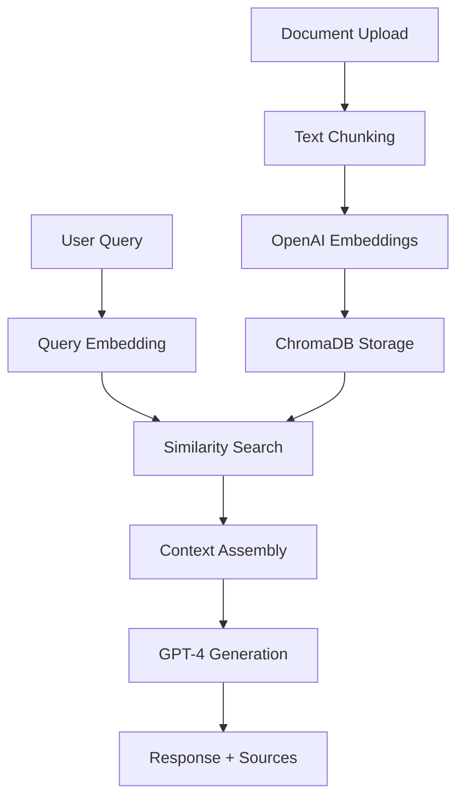

# 🧠 Document Intelligence Platform

> RAG-powered document analysis system built with OpenAI, ChromaDB, and React

[](https://python.org)
[](https://reactjs.org)
[](https://fastapi.tiangolo.com)
[](https://openai.com)
[](LICENSE)

## 🚀 Overview

A production-ready **Retrieval-Augmented Generation (RAG)** system that enables intelligent document analysis and question-answering. Upload documents, ask questions, and get AI-powered responses with source citations and confidence scores.

### ✨ Key Features

- 📄 **Document Upload & Processing** - Support for TXT, PDF, and Markdown files
- 🧠 **Intelligent Chunking** - Smart text segmentation with overlap for context preservation  
- 🔍 **Semantic Search** - Vector similarity search using OpenAI embeddings
- 💬 **RAG Query System** - GPT-4 powered responses grounded in your documents
- 📊 **Source Attribution** - Full traceability with confidence scores and source citations
- 🎨 **Modern UI** - Responsive React interface with real-time chat experience
- ⚡ **Production Ready** - FastAPI backend with proper error handling and CORS

## 🏗️ Architecture



### Tech Stack

**Backend:**
- 🐍 **Python 3.11+** with FastAPI
- 🤖 **OpenAI GPT-4** for generation and embeddings
- 📊 **ChromaDB** for vector storage
- 🔧 **Pydantic** for data validation

**Frontend:**
- ⚛️ **React 18** with functional components
- 🎨 **Custom CSS** with modern design patterns
- 📱 **Responsive** mobile-first approach

## 🚀 Quick Start

### Prerequisites

- Python 3.11+
- Node.js 16+
- OpenAI API key

### Installation

1. **Clone the repository**
   ```bash
   git clone https://github.com/Gockki/rag-document-intelligence.git
   cd rag-document-intelligence
   ```

2. **Setup Backend**
   ```bash
   cd backend
   python -m venv venv
   source venv/bin/activate  # On Windows: venv\Scripts\activate
   pip install -r requirements.txt
   ```

3. **Configure Environment**
   ```bash
   cp .env.example .env
   # Edit .env and add your OpenAI API key
   ```

4. **Setup Frontend**
   ```bash
   cd ../frontend
   npm install
   ```

### Running the Application

1. **Start Backend** (Terminal 1)
   ```bash
   cd backend
   source venv/bin/activate
   uvicorn main:app --reload
   ```

2. **Start Frontend** (Terminal 2)
   ```bash
   cd frontend
   npm start
   ```

3. **Access Application**
   - Frontend: http://localhost:3000
   - Backend API: http://localhost:8000
   - API Docs: http://localhost:8000/docs

## 📖 Usage

1. **Upload Documents** - Click upload area and select TXT, PDF, or MD files
2. **Ask Questions** - Type questions about your uploaded documents
3. **Get AI Responses** - Receive contextual answers with source citations
4. **View Sources** - See exactly which document sections informed each answer

### Example Queries

```
"What is the main topic of this document?"
"Summarize the key findings"
"What recommendations are mentioned?"
"Compare the different approaches discussed"
```

## 🐳 Docker Deployment

Run the entire stack with Docker Compose:

```bash
# Copy environment file
cp .env.example .env

# Start services
docker-compose up -d

# Access at http://localhost:3000
```

## 📁 Project Structure

```
rag-document-intelligence/
├── backend/           # FastAPI application
├── frontend/          # React application  
├── docs/             # Documentation
├── screenshots/      # UI screenshots
└── docker-compose.yml
```

## 🔧 API Reference

### Core Endpoints

- `POST /upload` - Upload and process documents
- `POST /query` - Query documents with RAG
- `GET /health` - Health check endpoint
- `GET /documents` - List uploaded documents

See [API Documentation](docs/api-docs.md) for detailed endpoint specifications.

## 🎯 Features Demonstrated

This project showcases practical implementation of:

- **RAG Architecture** - Production-ready retrieval-augmented generation
- **Vector Databases** - Efficient similarity search with ChromaDB
- **OpenAI Integration** - Both embeddings and chat completions APIs
- **Document Processing** - Intelligent text chunking and metadata handling
- **Source Attribution** - Maintaining document traceability
- **Modern Web Development** - React + FastAPI full-stack application
- **API Design** - RESTful endpoints with proper error handling

## 🚀 Deployment Options

- **Local Development** - uvicorn + npm start
- **Docker** - Containerized deployment
- **Cloud Platforms** - AWS, Azure, GCP ready
- **Static Hosting** - Frontend deployable to Vercel, Netlify

## 🤝 Contributing

1. Fork the repository
2. Create your feature branch (`git checkout -b feature/AmazingFeature`)
3. Commit your changes (`git commit -m 'Add some AmazingFeature'`)
4. Push to the branch (`git push origin feature/AmazingFeature`)
5. Open a Pull Request

## 📝 License

This project is licensed under the MIT License - see the [LICENSE](LICENSE) file for details.

## 📧 Contact

**Your Name** - jere.kokki@gmail.com

Project Link: [https://github.com/Gockki/rag-document-intelligence](https://github.com/Gockki/rag-document-intelligence)

---

⭐ Star this repository if it helped you build RAG applications!